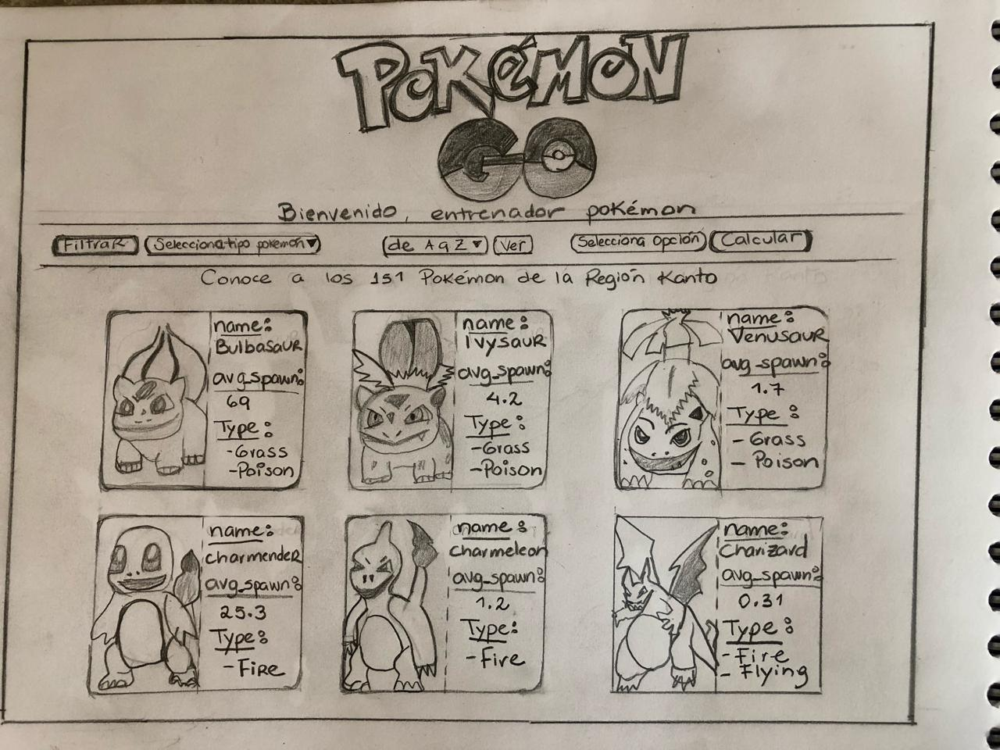
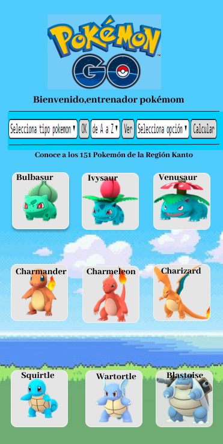

# **Guía de campeones Pokémon GO**

## Índice

* [Definición de producto](#Definición-de-producto)
* [Historias de usuario](#Historias-de-usuario)
* [Prototipo de baja fidelidad Sketch](#Prototipo-de-baja-fidelidad-Sketch)
* [Prototipo de alta fidelidad Figma](#Prototipo-de-alta-fidelidad-Figma)
* [Zeplin link](#Zeplin-link)
* [Testeos de Usabilidad](#Testeos-de-Usabilidad)

***

## Definición de producto
Hemos construido una página web que sirva como herramienta para mejorar el  desempeño del jugador habitual de Pokémon GO quien vendría a ser nuestro usuario objetivo.

Para diseñar esta web nos basamos en las entrevistas que realizamos a jugadores habituales de Pokémon GO   indagando sobre sus problemas más frecuentes y preguntándoles como creían ellos que mejoraría su experiencia y desempeño al jugar.

Sus respuestas indicaron que necesitaban ver la  información de pokemones presentada de  cierta manera y sobre todo algunas características que ellos consideran más importantes para  jugar mejor lo que se tradujo en nuestras historias de usuario.

Nuestro producto ayuda a mejorar la estrategia del usuario al manejar la información más requerida o relevante para  ellos además les ahorra tiempo al no tener que analizar toda la informacion y retenerla por ellos mismos.Nuestro usuario tendría la información mostrada en nuestra página a manera de guia al jugar Pokémon GO.

## Historias de usuario
* *Mostrar Data*: Según usuarios desean que se muestre por defecto en la web al ingresar solo información relevante como la imagen y el nombre, para que sea más ordenada y simple de usar.

* *Filtrar Data*: Los usuarios indicaron que les gustaría un  filtro por tipo de pokemon porque conocer esta información les sería útil antes de empezar a jugar Pokemon GO.

* *Ordenar Data*: Usuarios desean que se les permita ordenar la data de manera alfabética ascendente(A-Z) y alfabética descendente(Z-A) ya que les ayudaría a encontrar más rápido el pokemón que les interesa.

* *Calcular Data*:Los jugadores de Pokémon GO indicaron que les ayudaría en sus decisiones tener el calculo de cuantos pokemones hay según el kilometraje que da el indicador egg.

## Prototipo de baja fidelidad Sketch
Se realizó siguiendo como pauta las historias de usuario que resultaron de las entrevistas a los jugadores de Pokemón GO y luego se fueron modificando a través de las iteraciones con los testeos de usabilidad.

***Sketch1 original***

***Sketch2 iteración***   

***Sketch3 iteración***    

## Prototipo de alta fidelidad Figma
Se usaron los colores azul y verde claro ya que son los colores que predominan en el juego Pokémon GO además los usuarios a los que entrevistamos también indicaron que les gustaría ver nuestra  web con los mismos colores del juego de esta manera se respeto la identidad gráfica de la app del juego para que nuestro producto fuera fácilmente identificable por todos los jugadores habiltuales de Pokémon GO.

Asimismo el usuario pidió que la interfaz fuera ordenada y clara, con la pantalla por defecto cuando ingresaran con pocos datos y que se viera principalmente la imagen de cada pokémon y su nombre.Para mantener el orden y la misma distancia en cada imagen se pusieron las imágenes con formato grid.

Al ser los colores principales de nuestra web claros, se escogio que las  letras fueran  oscuras para que haya contraste y así los usuarios no tengan que forzar la vista.

Para nuestro usuario lo parte principal ya que es lo que más usará de nuestra página  son los selectores por eso se puso a manera de barra al empezar la página y en letra grande.

#### Interfaz

#### Interfaz en iphone  

## Zeplin link

*web link*  
<https://zpl.io/Vkwe4pZ>  

*app URI*  
<zpl://screen?pid=5c2eded3bae2c22086c9fabe&sid=5c2edf791180cb21544c720c>

*Project Link*  
<https://zpl.io/VYGo6Nd>

## Testeos de Usabilidad  

* Para la historia de usuario 1 ,mostrar data,en la pantalla  que sale por defecto al ingresar a la web(en el prototipo de baja fidelidad) habíamos colocado imagen de cada pokemon con nombre de cada pokemon,probabilidad de verlo(avg_spawn) y tipo de pokemon pero usuario nos indico que sería más claro si al ingresar solo se veía la imagen del pokemon con su nombre, lo cual corregimos.

* En historia de usuario 2,filtrar data,usuario indico que el selector para escoger el tipo de pokemon debería estar a la izquierda del botón para ejecutar el filtrado y no a la derecha ya que era más intuitivo asi que se cambió.

* Asimismo en la historia de usuario 2,filtrar data,indicaron que al incluir ya en el campo de seleccion la información selecciona tipo de pokemón entonces el nombre del botón que estaba al lado para ejecutarlo ya no se necesitaba llamar filtrar ya que era obvio lo que hacia con la indicación anterior y que más bien se prestaba a confusión por lo que se le coloco al botón solo la palabra OK que era más claro.
